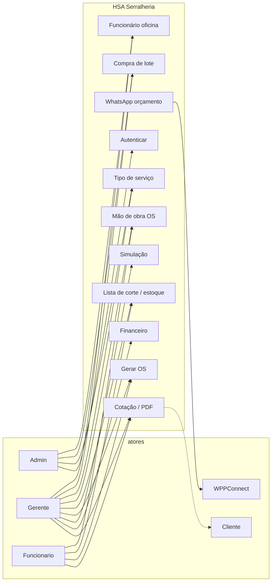
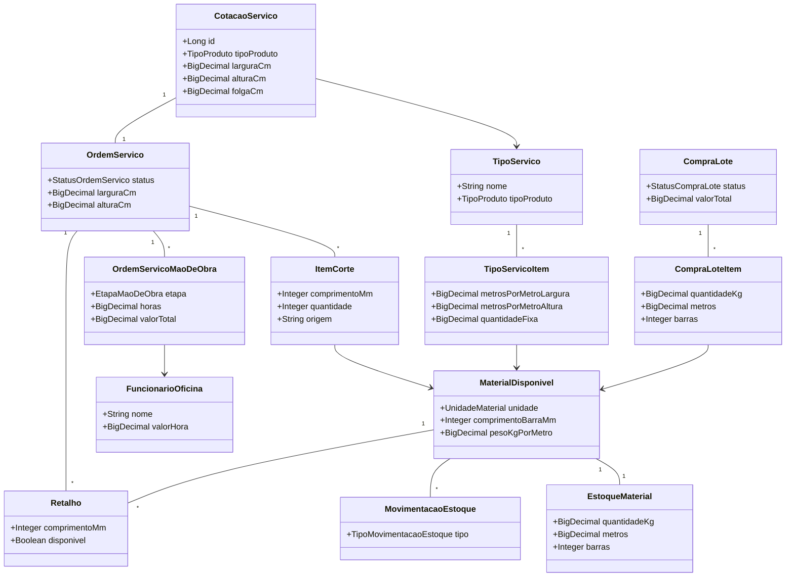
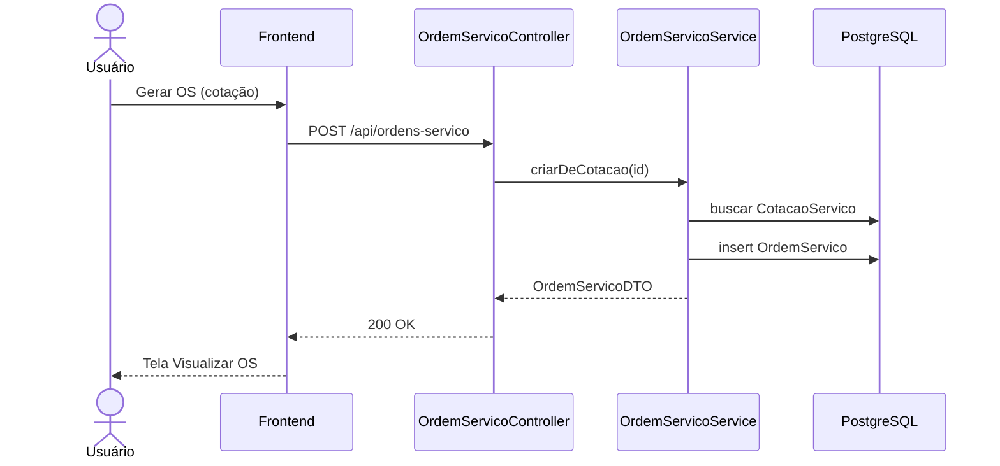
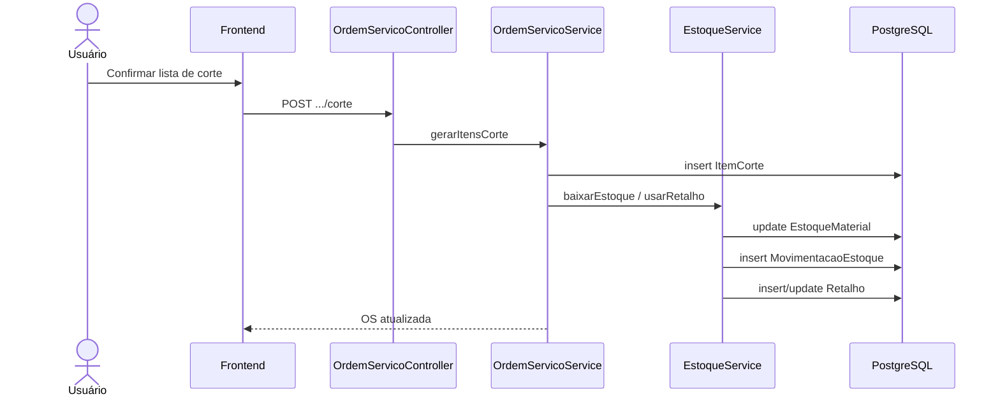
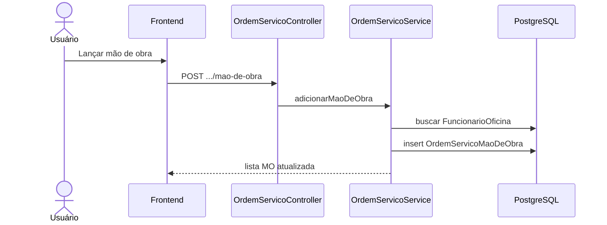
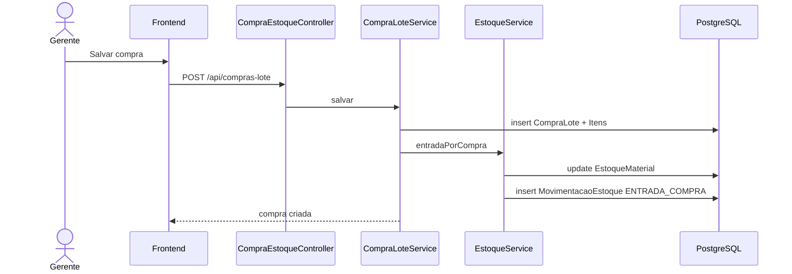
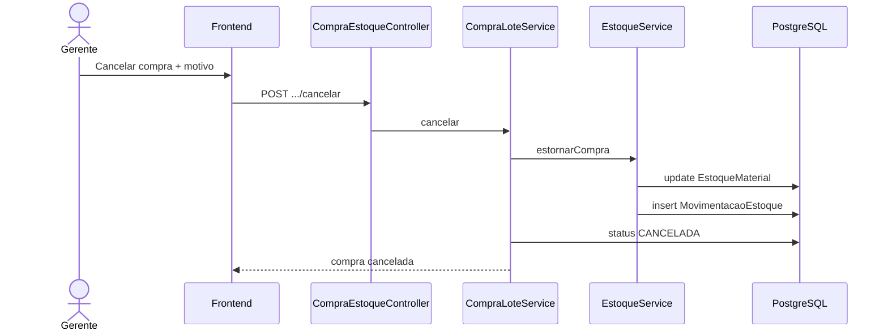
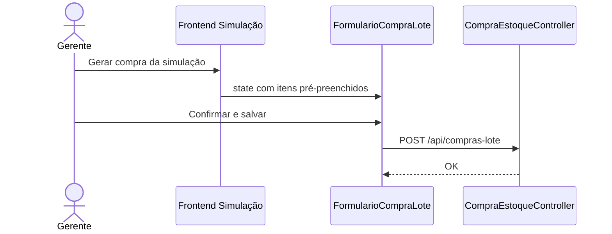
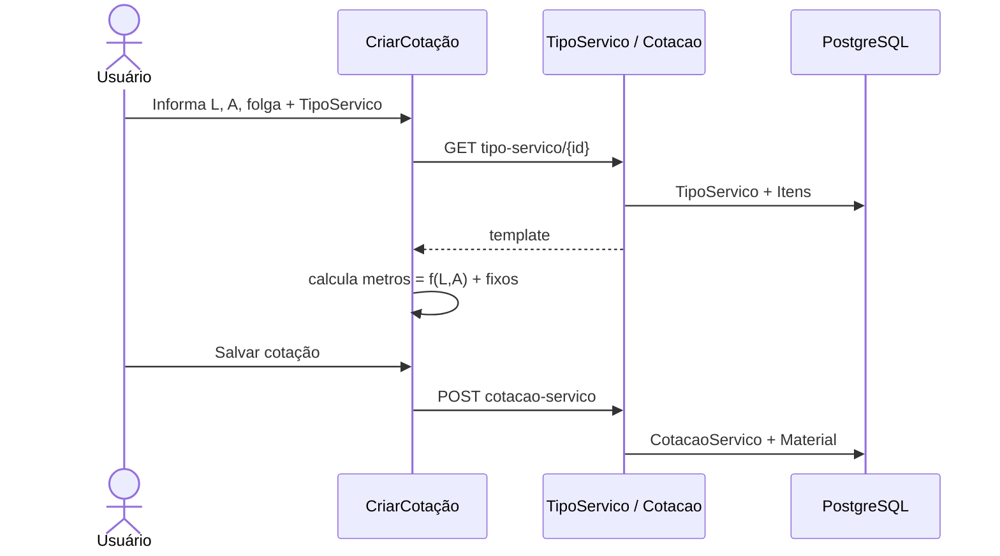

# HSA Serralheria – Atualização da Documentação do TCC
## PARTE 3 – Classes, Casos de Uso e Sequências (texto + Mermaid)

**Uso:** copiar textos para o Cap. 5; colar Mermaid no [mermaid.live](https://mermaid.live) / Draw.io / exportar PNG e inserir como Figuras no ODT.

**Contagens atuais (corrigir Cap. 3/4 na Parte 4):** 27 controllers, 37 services, 32 repositories, 45 arquivos em entity/, 21 páginas React, 21 services frontend.

---

## 5.1 – Atores e Casos de Uso (atualizar Figura 2)

### Atores (mantidos)
| Ator | Papel |
|------|--------|
| Admin | Acesso total; usuários, permissões, configurações |
| Gerente | Operação comercial/oficina + financeiro |
| Funcionario | Operação limitada (orçamentos, OS, materiais conforme RoleRoute) |
| Cliente | Externo (recebe PDF/WhatsApp; não autentica no sistema) |
| WPPConnect | Sistema externo de envio WhatsApp |

### Casos de uso – já existentes (manter na figura)
- Autenticar / Recuperar senha
- Gerenciar usuários e permissões
- Cadastrar/editar cotação (orçamento)
- Gerar PDF da cotação
- Enviar orçamento/cobrança via WhatsApp
- Gerenciar contas financeiras
- Simular produção
- Gerenciar materiais e preços / importar planilha
- Gerar relatórios
- CRUD genérico (listar/criar/editar/excluir)

### Casos de uso – **novos** (incluir na Figura 2)
| UC | Nome | Atores |
|----|------|--------|
| UC-OS-01 | Gerar Ordem de Serviço a partir da cotação | Gerente, Funcionario, Admin |
| UC-OS-02 | Acompanhar status da OS (corte→entrega) | Gerente, Funcionario, Admin |
| UC-OS-03 | Gerar lista de corte e baixar estoque | Gerente, Funcionario, Admin |
| UC-OS-04 | Lançar mão de obra na OS | Gerente, Funcionario, Admin |
| UC-TS-01 | Cadastrar Tipo de Serviço (template) | Gerente, Admin |
| UC-TS-02 | Montar materiais da cotação a partir do template + medidas | Gerente, Funcionario, Admin |
| UC-FO-01 | Cadastrar Funcionário da oficina | Gerente, Admin |
| UC-CL-01 | Registrar Compra de lote | Gerente, Admin |
| UC-CL-02 | Cancelar compra (estorno de estoque) | Gerente, Admin |
| UC-CL-03 | Gerar compra a partir da simulação | Gerente, Admin |
| UC-ES-01 | Consultar estoque e retalhos | Gerente, Funcionario, Admin |

### Texto sugerido (5.1)
> O diagrama de caso de uso representa as principais funcionalidades do sistema e os atores envolvidos, incluindo os módulos de ordem de serviço, tipos de serviço (templates de produção), funcionários da oficina, compra de materiais em lote, estoque e retalhos, além dos módulos já previstos de orçamento, financeiro, simulação e WhatsApp.

### Mermaid – esboço Caso de Uso (Figura 2)



---

## 5.2 – Tabela 1 atualizada (Identificação das Classes)

| Classes | Identificação |
|---------|---------------|
| Pessoa / Usuário | Login, autenticação, perfis (Admin/Gerente/Funcionario) |
| CotacaoServico | Orçamento: cliente, materiais, custos, medidas (L×A×folga), tipo de produto/serviço, análise de distribuidoras |
| Material | Item da cotação: quantidade, metros lineares e peso (kg) |
| MaterialDisponivel | Catálogo: unidade (barra/m/kg), comprimento da barra (mm), peso kg/m |
| MaterialPreco | Preços por material e distribuidora com vigência |
| Distribuidora | Fornecedores vinculados a cotações e compras |
| ContaFinanceira | Contas a pagar/receber, parcelamento e baixas |
| Simulacao / SimulacaoItem | Simulação de consumo; atalho para gerar compra de lote |
| TipoServico / TipoServicoItem | Template de produção: fatores de metros por largura/altura e qtd. fixa |
| OrdemServico | OS gerada da cotação: status da oficina, medidas, cliente |
| ItemCorte | Peças do plano de corte (comprimento mm, origem estoque/retalho) |
| OrdemServicoMaoDeObra | Horas e valor por etapa (corte, solda, pintura…) |
| FuncionarioOficina | Cadastro operacional da oficina (valor/hora, cargo) |
| CompraLote / CompraLoteItem | Compra em kg/metros/barras; status ATIVA/CANCELADA |
| EstoqueMaterial | Saldo atual por material (kg, metros, barras) |
| MovimentacaoEstoque | Histórico de entradas/saídas/ajustes |
| Retalho | Sobra reutilizável gerada no corte |
| ConfiguracaoWhatsapp | Templates e credenciais WPPConnect |
| WhatsappEnvioLog | Log de envios |
| Produto | Catálogo comercial |
| Permissao / PermissaoPessoa | Perfis de acesso |
| Estado / Cidade | Localização |

Fonte: Do autor

**Texto 5.2 sugerido:**  
> As classes identificadas refletem o domínio da serralheria: da cotação com medidas e templates até a ordem de serviço, o plano de corte com aproveitamento de retalhos, o estoque alimentado por compras em lote e o lançamento de mão de obra por etapa produtiva.

---

## 5.3 – Diagrama de Classes (atualizar Figura 3)

### Relacionamentos a desenhar (núcleo novo)

```
TipoServico 1──* TipoServicoItem *──1 MaterialDisponivel
CotacaoServico *──1 TipoServico
CotacaoServico 1──* Material *──1 MaterialDisponivel
CotacaoServico 1──1 OrdemServico
OrdemServico *──1 TipoServico
OrdemServico 1──* ItemCorte *──1 MaterialDisponivel
OrdemServico 1──* OrdemServicoMaoDeObra *──1 FuncionarioOficina
OrdemServico 1──* Retalho
MaterialDisponivel 1──1 EstoqueMaterial
MaterialDisponivel 1──* MovimentacaoEstoque
MaterialDisponivel 1──* CompraLoteItem *──1 CompraLote *──1 Distribuidora
```

### Mermaid – diagrama de classes (núcleo oficina)



---

## 5.4 – Novas sequências (Figuras sugeridas 22+)

Manter Figuras 4–17. Acrescentar:

| Figura | Título |
|--------|--------|
| 22 | Seq. – Gerar OS a partir da Cotação |
| 23 | Seq. – Gerar Lista de Corte / Baixa Estoque |
| 24 | Seq. – Lançar Mão de Obra na OS |
| 25 | Seq. – Compra de Lote (entrada estoque) |
| 26 | Seq. – Cancelar Compra (estorno) |
| 27 | Seq. – Compra a partir da Simulação |
| 28 | Seq. – Cadastro Tipo de Serviço + montagem na cotação |

*(Ajuste a numeração após as figuras atuais 18–21 de deploy/DER/arquitetura.)*

---

### 5.4.x – Gerar OS a partir da Cotação

**Narrativa:** Usuário abre a cotação → aciona “Gerar OS” → Frontend chama `POST /api/ordens-servico` com `idCotacao` → `OrdemServicoService` valida cotação, copia cliente/medidas/tipo, persiste OS com status `APROVADO` → retorna DTO → tela de detalhe da OS.



---

### 5.4.x – Gerar Lista de Corte / Baixa de Estoque

**Narrativa:** Na OS, usuário define peças (ou gera plano) → service calcula barras, usa retalhos disponíveis quando couber → grava `ItemCorte` → registra `MovimentacaoEstoque` tipo `SAIDA_OS` e/ou cria `Retalho` → atualiza `EstoqueMaterial`.



---

### 5.4.x – Lançar Mão de Obra

**Narrativa:** Usuário seleciona funcionário, etapa e horas → `valorTotal = horas × valorHora` → persiste `OrdemServicoMaoDeObra`.



---

### 5.4.x – Compra de Lote (entrada)

**Narrativa:** Formulário de compra → itens (kg/metros/barras/valor) → `CompraLoteService` grava lote `ATIVA` → `EstoqueService` soma saldos e lança `ENTRADA_COMPRA`.



---

### 5.4.x – Cancelar Compra (estorno)

**Narrativa:** Modal com motivo → status `CANCELADA` → estorno das quantidades no estoque (movimentação inversa/ajuste) → impede novo cancelamento.



---

### 5.4.x – Compra a partir da Simulação

**Narrativa:** Em Simulação de Produção, “Gerar compra” → Frontend navega para `/compras-lote/nova` com itens pré-preenchidos (material, kg/metros) → usuário confirma distribuidora/valores → mesmo fluxo de Compra de Lote.



---

### 5.4.x – Tipo de Serviço + montagem na cotação

**Narrativa:** Cadastro do template e itens (fatores L/A) → na Criar Cotação, usuário informa medidas e escolhe tipo → Frontend/serviço calcula metros/peso dos materiais → preenche lista da cotação.



---

## Lista de Ilustrações – itens a acrescentar

- Figura 2 (refazer) – Caso de Uso com UC de OS/estoque/compra  
- Figura 3 (refazer) – Classes com núcleo oficina  
- Figura 20 (refazer) – DER com tabelas da Parte 2  
- Figuras 22–28 – sequências acima  

---

## Próxima entrega (PARTE 4)
Textos atualizados dos Capítulos 3, 4, 6 (intro DER), 8 (permissões) + Resumo/Abstract + números de stack (27 ctrl / 37 svc / 45 entity…).
